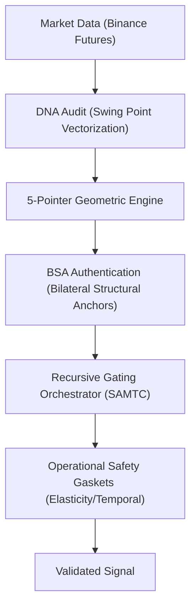

# SIGMA-Crypto-ASCEND

**State Aware Multi Temporal Consensus (SAMTC) Engine**  
*A quantitative execution framework for Crypto Perpetuals, implementing fractal logic within a vectorized Python environment.*

---

## System Architecture

The SIGMA engine is built on a **Recursive Gating Hierarchy**, designed to filter non-stationary noise and capture institutional liquidity search operations.



### Core Components
- **`core/detectors`**: The **DNA Audit** & **Breakout Lifecycle** engines. Implements vectorized 5-pointer geometry for deterministic anchor authentication.
- **`core/strategy`**: The **SAMTC Orchestrator**. Manages multi-temporal consensus and recursive state-awareness (Macro → Micro alignment).
- **`simulation/`**: High-fidelity vectorized backtester with **Monte Carlo convergence** validation.
- **`dashboard/`**: Real-time strategy monitoring and forensic audit trail visualization.

---

## Methodology: "The Physics of Alpha"

The strategy operates on the principle of **Structural Imbalance Recognition** rather than simple pattern matching.

### 1. Bilateral Structural Anchors (BSA)
Model price as a directed search operation between authenticated anchors. A BSA is not a "zone"—it represents the structural state defined by the **3-pass/5-pointer geometric limit**.

### 2. Multi-Temporal Consensus (SAMTC)
Execution is only authorized when the **Fractal Storyline** is in alignment across specific timeframes (MN1 → W1 → D1). This provides a **Recursive Gating Logic** shield.

### 3. Siege Audit (T0-T3)
Dynamic tracking of anchor degradation. The system differentiates between **Untested** liquidity (T0) and "Exhausted" structural gaskets (T3), preventing entries into decayed signals.

---

## Performance Attribution

Verified against 7 years of multi-regime data (2018–2025):
- **Max Alpha (Test 9G)**: CAGR 432.3% | Sharpe 1.90
- **Governance (Test 10C)**: Calmar 3.90 | Recovery Factor 13.21 | Sortino 3.06
- **Stability**: Passed 10,000-iteration Monte Carlo convergence test.

---

## Deployment & Auditing

### Environment Setup
```bash
# Clone and initialize
git clone https://github.com/smz3/SIGMA-Crypto-ASCEND.git
cd SIGMA-Crypto-ASCEND

# Initialize environment
pip install -r requirements.txt
```

### Research Documentation
The full mathematical basis for this engine is detailed in the primary strategy paper located at:  
[**SAMTC_SR: State Aware Multi Temporal Consensus**](file:///research/thesis/SAMTC_SR.pdf)

---
*Created by Syafiq M. Zin for the ASCEND Quant Researcher Strategy Builder Submission.*
